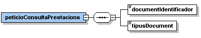
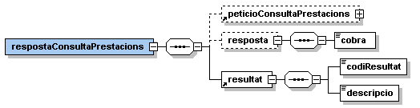
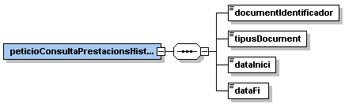
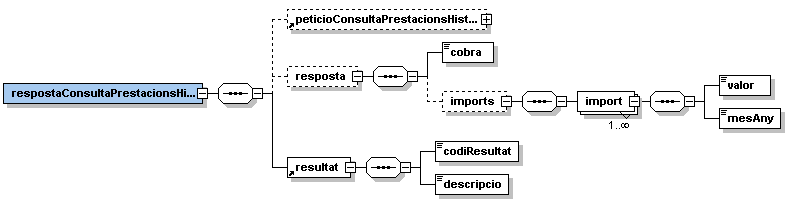

# **Via Oberta – Renda Garantida Ciutadana**

# **Document d&#39;integració del servei**

**Històric de revisions**

| **Versió** | **Data** | **Autor** | **Comentaris** |
| --- | --- | --- | --- |
| V1.0 | 11/02/2022 | Roger Noguera i Arnau | Creació del document |

### Índex

- [1. Introducció](#1)
- [2. Transmissions de dades disponibles](#2)
- [3. Missatgeria dels serveis](#3)
   * [3.1. Situació d&#39;un ciutadà en relació a la Renda Garantida Ciutadana (RGC\_CONSULTA)](#3.1)
		* [3.1.1 Petició – dades específiques](#3.1.1)
		* [3.1.2 Resposta - dades específiques](#3.1.2)
   * [3.2. Imports rebuts en un període de temps (RGC\_CONSULTA\_HISTORIC)](#3.2)
		* [3.2.1 Petició – dades específiques](#3.2.1)
		* [3.2.2 Resposta - dades específiques](#3.2.2)
- [4. Joc de proves](#4)

# 1 Introducció 

Aquest document detalla la missatgeria associada al servei de consulta de les prestacions Renda Garantida Ciutadana (en endavant RGC) del Departament de Drets Socials.

Per poder realitzar la integració cal conèixer prèviament la següent documentació:

- Document del Servei Via Oberta.
- [Document de Missatgeria Genèrica de la PCI del Consorci AOC.][PCI]

[PCI]:https://github.com/ConsorciAOC/PCI

# 2 Transmissions de dades disponibles 

Les dades disponibles a través del servei són les que es presenten a continuació:

| **EMISSOR** |
| --- |
| Departament de Drets Socials (Generalitat de Catalunya) |

| **PRODUCTE** | **MODALITAT** | **DESCRIPCIO** |
| --- | --- | --- |
| **RGC** | RGC\_CONSULTA | Consulta situació de les prestacions RGC d&#39;un ciutadà.|
| **RGC** | RGC\_CONSULTA\_HISTORIC | Consulta de dades històriques de les prestacions RGC d&#39;un ciutadà.|

Totes les consultes del producte tenen disponible la versió imprimible del resultat de la consulta en format PDF. Per més detalls adreceu-vos a l&#39;apartat _Extensions de missatgeria_ del document de missatgeria genèrica.

# 3 Missatgeria dels serveis 

A continuació es detalla la missatgeria corresponent al bloc de dades específiques de les modalitats de consum del producte RGC.

## 3.1 Situació d&#39;un ciutadà en relació a la Renda Garantida Ciutadana (RGC\_CONSULTA) 

### 3.1.1 Petició – dades específiques 

| _Element_ | _Descripció_ |
| --- | --- |
| peticioConsultaPrestacions/documentIdentificador | Document identificador del titular que es vol fer la consulta. |
| peticioConsultaPrestacions/tipusDocument | Tipus de document identificador :<li>00001: Document nacional d&#39;identitat<li>00002: Número d&#39;identificació estrangers<li>00003: Targeta d&#39;identificació Sanitaria<li>00004: Número d&#39;afiliació de la Seguretat Social<li>00005: Número d&#39;usuari de la Seguretat Social<li>00006: Número d&#39;identificació fiscal<li>00007: Número d&#39;identificació fiscal per estrangers sense NIE<li>00008: Número d&#39;identificació fiscal per espanyols no residents<li>00009: Número d&#39;identificador fiscal per a menors de 14 anys i residents<li>00010: Número identificador per comunitaris<li>00011: Número dels mossos per a menors<li>00012: Passaport<li>00013: Provisional<li> 99999: Desconegut|

### 3.1.2 Resposta – dades específiques 

| _Element_ | _Descripció_ |
| --- | --- |
| respostaConsultaPrestacions/peticioConsultaPrestacions | Bloc de dades corresponent a la petició que genera la resposta. |
| respostaConsultaPrestacions/resposta/cobra | Indica si el ciutadà percep la Renda Garantida Ciutadana:<li>COBRA<li>NO\_COBRA<li>SENSE\_INFORMACIO |
| respostaConsultaPrestacions/resultat/codiResultat | Codi de resultat de la consulta:<li>0: consulta realitzada correctament.<li>0502: error realitzant la consulta. |
| respostaConsultaPrestacions/resultat/descripcio | Descripció del resultat. |

## 3.2 Imports rebuts en un període de temps (RGC\_CONSULTA\_HISTORIC) 

### 3.2.1 Petició – dades específiques 

| _Element_ | _Descripció_ |
| --- | --- |
| peticioConsultaPrestacionsHistoric/documentIdentificador | Document identificador del titular que es vol fer la consulta. |
| peticioConsultaPrestacionsHistoric/tipusDocument | Tipus de document identificador :<li>00001: Document nacional d&#39;identitat<li>00002: Número d&#39;identificació estrangers<li>00003: Targeta d&#39;identificació Sanitaria<li>00004: Número d&#39;afiliació de la Seguretat Social<li>00005: Número d&#39;usuari de la Seguretat Social<li>00006: Número d&#39;identificació fiscal<li>00007: Número d&#39;identificació fiscal per estrangers sense NIE<li>00008: Número d&#39;identificació fiscal per espanyols no residents<li>00009: Número d&#39;identificador fiscal per a menors de 14 anys i residents<li>00010: Número identificador per comunitaris<li>00011: Número dels mossos per a menors<li>00012: Passaport<li>00013: Provisional<li>99999: Desconegut |
| peticioConsultaPrestacionsHistoric/dataInici | Data d&#39;inici del període a consultar (AAAA-MM-DD). |
| peticioConsultaPrestacionsHistoric/dataFi | Data de fi del període a consultar (AAAA-MM-DD). |

### 3.2.2 Resposta – dades específiques 

| _Element_ | _Descripció_ |
| --- | --- |
| respostaConsultaPrestacionsHistoric/peticioConsultaPrestacionsHistoric | Bloc de dades corresponent a la petició que genera la resposta. |
| respostaConsultaPrestacionsHistoric/resposta/cobra | Indica si el ciutadà percep la Renda Garantida Ciutadana:<li>COBRA<li>NO\_COBRA<li>SENSE\_INFORMACIO |
| respostaConsultaPrestacionsHistoric/resposta/imports/import | Bloc de dades corresponent a un import percebut. |
| //import/valor | Import percebut. |
| //import/mesAny | Període (AAAA-MM). |
| respostaConsultaPrestacionsHistoric/resultat/codiResultat | Codi de resultat de la consulta:<li>0: consulta realitzada correctament.<li>0502: error realitzant la consulta. |
| respostaConsultaPrestacionsHistoric/resultat/descripcio | Descripció del resultat. |

# 4 Joc de proves 

L&#39;emissor final publica els següent [joc de proves a l&#39;entorn de pre-producció][proves] 

[proves]: http://transversals.ctti.intranet.gencat.cat/sol-pica-iop-gene/rgc/

 En cas de tindre problemes per accedir als jocs de proves, si us plau, obre un tiquet a través del [formulari][form]

[form]:https://www.aoc.cat/portal-suport/peticio-integradors/idservei/integracio/
